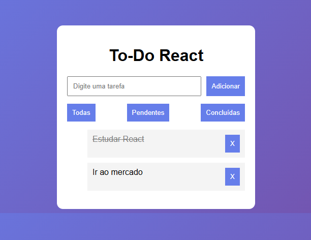

# 📝 To-Do App em React

Aplicação web de gerenciamento de tarefas desenvolvida com React, permitindo adicionar, concluir, filtrar e remover tarefas, com persistência de dados no navegador.

---

## 🚀 Tecnologias utilizadas

- React
- JavaScript (ES6+)
- HTML5
- CSS3

---

## ✨ Funcionalidades

- ➕ Adicionar tarefas
- ✅ Marcar como concluída
- ❌ Remover tarefas
- 🔍 Filtrar por:
  - Todas
  - Pendentes
  - Concluídas
- 💾 Persistência com LocalStorage

---

## 📸 Preview



---

## 🔗 Acesse o projeto

👉 Em breve disponível online

---

## 📂 Como rodar o projeto

```bash
# Clonar o repositório
git clone https://github.com/afroagg/todo-react.git

# Entrar na pasta
cd todo-react

# Instalar dependências
npm install

# Rodar o projeto
npm start
